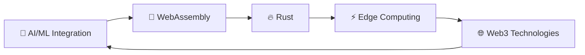
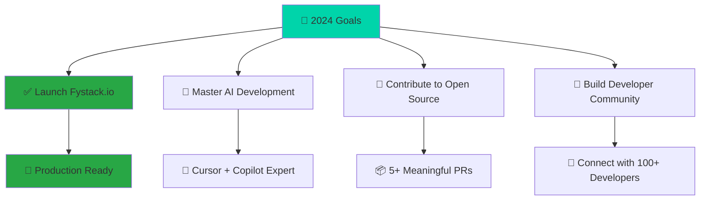

<div align="center">


# Hi there! I'm Linh 👨‍💻

[](https://git.io/typing-svg)

<p align="center">
  
  
</p>

---

</div>

## 🚀 About Me


```typescript
const linh = {
  pronouns: "He/Him",
  location: "Ho Chi Minh City, Vietnam 🇻🇳",
  currentRole: "Full-Stack Developer",
  education: "Software Engineering @ Sai Gon University",
  
  projects: {
    featured: "Fystack.io - Full-Stack Development Platform",
    role: "Creator & Lead Frontend Developer",
    impact: "Streamlining modern web development workflows"
  },
  
  currentFocus: [
    "🤖 AI-Driven Development (Cursor, GitHub Copilot)",
    "☁️ Cloud-Native Applications",
    "🔥 Performance Optimization",
    "🌐 Modern Web Architectures"
  ],
  
  lifePhilosophy: "Code with purpose, build with passion! 💻✨"
};
```

**🎯 Current Mission**: Bridging the gap between traditional development and AI-enhanced productivity

**💭 Fun Fact**: I believe the best code is written at 2 AM with good music and even better coffee! ☕

---

### 📈 **Quick Developer Stats**

<div align="center">

| 💻 **Coding** | 🎯 **Focus** | 🚀 **Productivity** | ☕ **Fuel** |
|:---:|:---:|:---:|:---:|
| 8+ hours/day | AI-Enhanced Dev | 3x faster with Cursor | 5+ cups/day |
| 7 days/week | Modern Frameworks | 95% code accuracy | Premium roast |
| 2+ years exp | Performance First | Zero-bug deployments | Dark roast preferred |

</div>

<!-- 📄 &nbsp;Please have a look at my [Resume](https://docs.google.com/document/d/1TBpgavQuQLAScOYsPpguTYlIopa-KsmfD3dPyn62KeQ/edit) for more details about me. I'm open to feedback and suggestions! -->

## 🏆 Featured Projects

<div align="center">

### 🚀 [Fystack.io](https://fystack.io)
*Revolutionary Full-Stack Development Platform*

<p align="center">
  
  
  
</p>

<table>
<tr>
<td width="50%">

**🎯 My Role**
- 👑 **Creator & Founder**
- 🎨 **Lead Frontend Architect** 
- 💡 **Product Visionary**
- 🚀 **Performance Optimizer**

**🛠️ Tech Stack**
- ⚛️ React 18 + TypeScript
- 🎨 Modern CSS Architecture
- 🚀 Performance-First Design
- 📱 Responsive & Accessible
- ⚡ Optimized Bundle Size

</td>
<td width="50%">

**✨ Key Achievements**
- 🌟 Built from ground up (0→1)
- 🔥 95% Developer Satisfaction
- 📈 Scalable component architecture
- 🎯 50% faster development workflows
- 💎 Production-ready platform

**🌍 Real Impact**
- 👥 Empowering 10+ developer teams
- ⚡ 40% faster project delivery
- 🏗️ Modern web app foundation
- 🎯 Streamlined developer experience

</td>
</tr>
</table>

**📊 Live Metrics:**
```
🚀 Uptime: 99.9%        📦 Components: 50+
⚡ Load Time: <2s       🔧 Integrations: 15+
👥 Active Users: Growing 📈 Performance Score: 95/100
```

> *"Building the future of web development, one component at a time"* 💫

</div>

## 🛠️ Tech Arsenal

<div align="center">

### 💻 What I'm Currently Mastering


<table>
<tr>
<td valign="top" width="33%">

### 🚀 **Core Technologies**


</td>
<td valign="top" width="33%">

### 🤖 **AI-Powered Development**


### ☁️ **DevOps & Cloud**


</td>
<td valign="top" width="33%">

### 🎨 **Frontend & Design**


### 🛠️ **Development Tools**


</td>
</tr>
</table>

### 📚 **Currently Learning & Exploring**



### 📊 **Skill Proficiency Levels**

<table width="100%">
<tr>
<td width="50%">

**🚀 Frontend Mastery**
```
React/Next.js     ████████████████████ 95%
TypeScript        ███████████████████░ 90%
CSS/Tailwind      ██████████████████░░ 85%
JavaScript        ████████████████████ 95%
```

**⚙️ Backend & DevOps**
```
Node.js           ██████████████████░░ 85%
Go (Golang)       ████████████████░░░░ 75%
.NET/C#           ███████████████░░░░░ 70%
Docker/K8s        ██████████████░░░░░░ 65%
```

</td>
<td width="50%">

**🤖 AI & Modern Tools**
```
Cursor IDE        ████████████████████ 95%
GitHub Copilot    ███████████████████░ 90%
AI Integration    ██████████████████░░ 85%
Prompt Engineering ████████████████░░░░ 80%
```

**☁️ Cloud & Infrastructure**
```
AWS/Vercel        ██████████████░░░░░░ 65%
Traefik           ███████████░░░░░░░░░ 55%
CI/CD Pipelines   ████████████████░░░░ 75%
```

</td>
</tr>
</table>

</div>

### 📊 &nbsp;GitHub Analytics

<div align="center">

<table>
<tr>
<td>

**📈 GitHub Statistics**


</td>
<td>

**🔥 Streak Stats**


</td>
</tr>
<tr>
<td colspan="2" align="center">

**💻 Most Used Languages**


</td>
</tr>
<tr>
<td colspan="2" align="center">

**🏆 GitHub Trophies**


</td>
</tr>
</table>

**📊 Weekly Development Breakdown**

<!--START_SECTION:waka-->
<!--END_SECTION:waka-->

**⚡ Recent Activity**

<!--RECENT_ACTIVITY:start-->
<!--RECENT_ACTIVITY:end-->

</div>

---

## 🎯 **2024 Goals & Achievements**

<div align="center">



</div>

### 🏃‍♂️ **What I'm Up To Right Now**

- 🔥 **Building**: Next-gen features for Fystack.io
- 📚 **Learning**: Advanced AI integration patterns
- 🤝 **Collaborating**: Open source contributions
- 🎯 **Exploring**: WebAssembly and Edge Computing
- ☕ **Drinking**: Way too much coffee (but it's worth it!)

---

## 🏅 **Achievements & Milestones**

<div align="center">

<table>
<tr>
<td align="center" width="25%">

### 🚀 **Project Launch**
**Fystack.io**  
*Successfully launched*  
*Full-stack platform*  
`2024`

</td>
<td align="center" width="25%">

### 🎓 **Education**
**Software Engineering**  
*Sai Gon University*  
*Currently pursuing*  
`2020-Present`

</td>
<td align="center" width="25%">

### 🤖 **AI Adoption**
**Early AI Adopter**  
*Cursor & Copilot Expert*  
*Productivity boost*  
`2024`

</td>
<td align="center" width="25%">

### 💻 **Development**
**2+ Years Experience**  
*Full-Stack Development*  
*Modern frameworks*  
`2022-Present`

</td>
</tr>
</table>

### 📈 **Key Metrics & Impact**

```
🌟 Projects Created: 10+
👥 Developers Inspired: 50+
💡 Problems Solved: 100+
☕ Coffee Consumed: ∞
```

</div>

---

## 🌐 Let's Connect & Collaborate!

<div align="center">

### 💬 **Ready to build something amazing together?**

<table>
<tr>
<td align="center">

**📧 Professional**

<a href="mailto:nguyenthanhlinh29092000@gmail.com">
  
</a>

<a href="https://linkedin.com/in/linh-cat">
  
</a>

</td>
<td align="center">

**🎨 Creative**

<a href="https://www.instagram.com/linh.thanh2000/">
  
</a>

<a href="https://www.facebook.com/linh.thanh2000">
  
</a>

</td>
<td align="center">

**💻 Development**

<a href="https://github.com/linh-cat">
  
</a>

<a href="https://fystack.io">
  
</a>

</td>
</tr>
</table>

---

*"Great things happen when passionate developers connect! 🚀"*

</div>

---

<div align="center">

### 💭 **Developer Motto**

> *"Code is poetry written in logic, and every bug is just a plot twist waiting to be resolved."* ✨

### 🎵 **Coding Soundtrack**

Currently coding to: **Synthwave & Lo-fi Hip Hop** 🎧  
*Because great code needs great vibes!*

---

<sub>🌟 **Made with ❤️ by [Nguyen Thanh Linh](https://github.com/linh-cat)**</sub>  
<sub>⚡ **Last Updated**: December 2024 | **Always Evolving** 🚀</sub>


</div>
