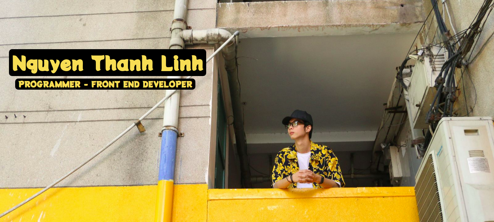

### Hi there 👋, I am Linh

### 👨🏻‍💻 &nbsp;About Me

💡 &nbsp;I am a Front-End developer with more than 2 years of experience. I like to explore new technologies and develop software solutions and quick hacks.\
🎓 &nbsp;I'm currently studying software engineer at the Sai Gon University of HCM.\
✍️ &nbsp;In my free time, I love to relax myself by listening to music and watching my favorite films. I study all days, so after 10 PM is the only time that I can use for myself. I have a smartphone, so I can download a lot of songs from the Internet for free, and I usually listen to them with my headphones. If noone is at home, I will turn on the loudspeakers to have the best experience with music, but most of the time I only listen to music with headphones. Besides music, movies are my second biggest love. When I am not listening to the songs, I turn on my computer and watch some of the latest movies on the websites. Since most of the best films are from Europe and America, this is also a way for me to improve my English skills. \

<!-- 📄 &nbsp;Please have a look at my [Resume](https://docs.google.com/document/d/1TBpgavQuQLAScOYsPpguTYlIopa-KsmfD3dPyn62KeQ/edit) for more details about me. I'm open to feedback and suggestions! -->

### 💻 Personal Project

- [INSTAGRAM](https://github.com/linh-cat/social-instagram-full)
- [NETFLIX](https://github.com/linh-cat/netflix-clone-react)
- [YOUTUBE](https://github.com/linh-cat/react-youtube)
- [Chat-app-UI](https://github.com/linh-cat/chat-app-ui)
- [Pinterest](https://github.com/linh-cat/pinterest-clone)
- [Fashe](https://github.com/linh-cat/NodeJS-Fashe)

### 🛠 &nbsp;Tech Stack

&nbsp;
&nbsp;
&nbsp;
&nbsp;
&nbsp;
&nbsp;
\
&nbsp;
&nbsp;
&nbsp;
&nbsp;
\
&nbsp;

### ⚙️ &nbsp;GitHub Analytics

### 🤝🏻 &nbsp;Connect with Me

Credits: [Nguyen Thanh Linh](https://github.com/linh-cat)

Last Edited on:24/01/2021.
